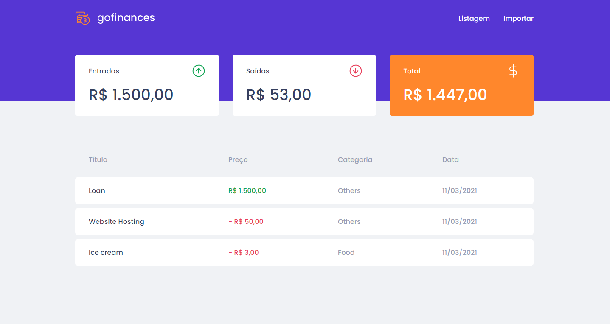
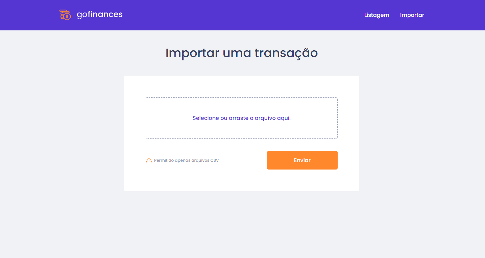

# GoFinances 💰
The best app to manage your money.

<hr>




## How to run 🚀:
```bash
# Make sure you have the backend running in your computer.
# Clone this repository
$ git clone https://github.com/EduardoBravoP/goFinances-web.git

# Go into the repository
$ cd goFinances-web

# Install dependencies
$ yarn

# Run the app (Web)
$ yarn start
```
